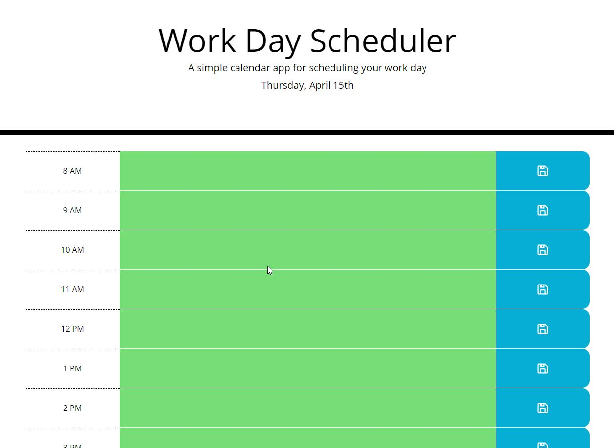

# Challenge 5: Third-Party APIs Challenge: Work Day Scheduler

## About/Description

This planner opens with a regular work amount of time slots (8am to 5pm).  When the planner is opened it checks the current date and time using moment.js. It displays the date at the top for the user to see.  Then goes through and assigns the color of gray, red, or green depending on the time.  Gray for if that hour has already passed, red for the current hour, and green for hours still in the future.  It will recheck the time ever half hour if the user leaves the browser open for an extended period of time.  Users can then click in the colored section and it will turn to a text area that they can add or delete text.  Clicking the button to the right saves it to local storage and the task will pull when the user reopens the browswer.  Clicking save also turns the textarea back into a regular div element from the text area.  The user can click again and can re-edit their tasks.  Tasks saved to localStorage will also load on the opening of the page.    

### User/Story

AS AN employee with a busy schedule
I WANT to add important events to a daily planner
SO THAT I can manage my time effectively

### Acceptance Criteria

GIVEN I am using a daily planner to create a schedule
WHEN I open the planner
THEN the current day is displayed at the top of the calendar
WHEN I scroll down
THEN I am presented with time blocks for standard business hours
WHEN I view the time blocks for that day
THEN each time block is color-coded to indicate whether it is in the past, present, or future
WHEN I click into a time block
THEN I can enter an event
WHEN I click the save button for that time block
THEN the text for that event is saved in local storage
WHEN I refresh the page
THEN the saved events persist

## Built With
* HTML
* CSS
* Javascript
* JQuery
* Bootstrap
* Moment.js
* Iconify

## Live Link

https://ds1242.github.io/work-day-planner/ 

## Screenshots

#### The page when opened:

#### User clicks and div changes to text area to add a task

#### User clicks the save button

#### Textarea returns to normal div element again. Which is clickable and editable again

#### Page at noon with colors set accordingly

